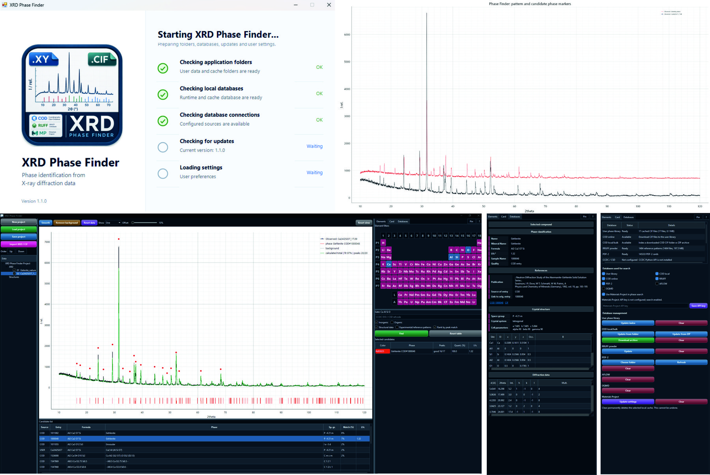

# XRD Analysis Toolkit


# Download XRD Phase Finder

**Windows 10/11:** [Download `XRD_Phase_Finder_Setup_1.1.0.exe`](https://github.com/ABKuznetsov/XRD_Analysis_Toolkit/releases/download/v1.1.0/XRD_Phase_Finder_Setup_1.1.0.exe) and run the installer.

**macOS:** [Download `XRD_Phase_Finder_macOS_1.1.0.zip`](https://github.com/ABKuznetsov/XRD_Analysis_Toolkit/releases/download/v1.1.0/XRD_Phase_Finder_macOS_1.1.0.zip), extract it and run `install_macos.command`.

More detailed installation notes are below in [Installation](#installation).

# XRD Phase Finder 1.1.0

Feature release focused on Phase Finder maintainability, background correction and cross-platform setup improvements.

# Overview

**XRD Phase Finder** is an open-source desktop tool for powder X-ray diffraction phase identification. It is built for everyday search-match work: load experimental XRD patterns, limit the chemistry by elements, search local or online phase sources, preview candidate peaks, inspect phase cards and keep selected phases in one project.



## What It Can Do

- import one or many XRD patterns and CIF files
- smooth patterns, subtract background and compare stacked patterns
- search candidates by required and optional elements
- preview calculated or measured reference peaks directly on the active pattern
- rank candidates by peak-match score and keep selected phase overlays
- calculate diffraction from CIF structures and display compound cards
- save projects with imported data, processing state, selected phases and view settings
- manage local caches, user libraries and external database folders from the Databases tab

## Data Sources

Open or publicly accessible sources supported or planned in the workflow include COD, Materials Project with the user's API key, AFLOW, OQMD, RRUFF measured patterns and user-provided CIF libraries.

Restricted databases are handled only as user-managed local data. PDF-2, CCDC/CSD and other commercial, institutional or private databases can be used only when the user already has the legal right to access them. The developers do **not** distribute closed or license-controlled databases with the installer.

## Notes

XRD Phase Finder is intended for phase identification and pre-refinement screening. It helps find chemically plausible candidates and compare their strongest calculated or measured peaks against the active pattern; it is not a replacement for full Rietveld refinement.

The application uses the Python scientific stack, including NumPy, SciPy, pybaselines, pyqtgraph, PySide6/Qt, gemmi and pymatgen for Materials Project workflows.

---

# Typical Workflow

```text
Load experimental XRD
        |
        |
Peak detection
        |
        |
Search candidate phases
(COD / local CIF / RRUFF / PDF-2 / CCDC / Materials Project)
        |
        |
Load crystal structures (CIF)
        |
        |
Calculate theoretical diffraction patterns
        |
        |
Compare experimental and calculated profiles
        |
        |
Assign diffraction peaks
        |
        |
Identify unexplained peaks
```

---

# Interaction Guide

- **Element table**
  - Left click marks an element as required.
  - Right click marks an element as optional.
  - Clicking again removes that element from the gate.
- **Candidate list**
  - Single click previews the candidate and opens its card.
  - Double click adds a structural candidate to the selected phase set.
  - Right click opens actions such as add, calculate overlay and export CIF.
- **Selected candidates**
  - Single click shows that phase in the plot and card.
  - Right click changes color, exports CIF, removes the phase or clears the list.
- **Project tree**
  - The highlighted XRD row is the active pattern for search and preview.
  - Checkboxes control what is visible in the plot.
  - Order arrows change plot and legend order.
- **Projects**
  - Save project stores imported XRD/CIF order, processed curves, selected phase assignments and Finder UI state.
- **Plot**
  - Use mouse zoom/pan normally.
  - `Reset view` or right click -> `Show full pattern` returns to the full range.

The `?` button in the application opens a compact in-app helper with the same core controls.

---

# Installation

## Download

Latest release assets:

- Windows 10/11: [XRD_Phase_Finder_Setup_1.1.0.exe](https://github.com/ABKuznetsov/XRD_Analysis_Toolkit/releases/download/v1.1.0/XRD_Phase_Finder_Setup_1.1.0.exe)
- macOS: [XRD_Phase_Finder_macOS_1.1.0.zip](https://github.com/ABKuznetsov/XRD_Analysis_Toolkit/releases/download/v1.1.0/XRD_Phase_Finder_macOS_1.1.0.zip)
- All releases: [GitHub Releases](https://github.com/ABKuznetsov/XRD_Analysis_Toolkit/releases)

Large crystallographic databases are user-managed. COD, RRUFF, PDF-2, Materials Project and CCDC/CSD data are not redistributed with the installer.

## Requirements

Windows installer:

- Windows 10 or Windows 11, 64-bit recommended.
- Administrator rights for installation into the selected application folder.
- Internet access during first setup, because Python or Python packages may need to be downloaded.
- About 1 GB of free disk space for the shared scientific Python environment.

Source checkout / macOS / Linux:

- Python 3.11 or newer.
- `pip` and Python virtual environment support.
- Internet access for installing Python packages.

XRD Phase Finder uses a shared per-user environment named `XRD_Toolkit`. Future XRD applications from the same toolkit can reuse it.

## Windows

Download and run:

```text
XRD_Phase_Finder_Setup_1.1.0.exe
```

The installer:

- installs XRD Phase Finder into the selected application folder
- creates Start Menu and optional Desktop shortcuts
- creates or reuses the shared `XRD_Toolkit` Python environment in user AppData
- installs required Python packages
- adds an uninstall entry to Windows
- checks for updates when XRD Phase Finder starts

If Python 3.11 is not already available, the setup script first tries `winget` and then falls back to the official Python 3.11.9 installer from python.org.

## macOS

Download and extract:

```text
XRD_Phase_Finder_macOS_1.1.0.zip
```

Then run:

```text
install_macos.command
```

The installer creates or reuses:

```text
~/Library/Application Support/XRD_Toolkit
```

and installs the application bundle to `/Applications/XRD Phase Finder.app` when possible, otherwise to `~/Applications/XRD Phase Finder.app`.

If macOS blocks the scripts after download or sync, run this once from Terminal inside the extracted folder:

```bash
chmod +x install_macos.command update_macos.command setup_env.command toolkit/*.command XRD_Finder/*.command
xattr -dr com.apple.quarantine .
```

Manual update from a source checkout:

```text
update_macos.command
```

Optional maintainer-only DMG build on macOS:

```text
scripts/build_macos_dmg.command
```

## Linux

Linux is currently source-checkout based:

```bash
chmod +x setup_env.sh XRD_Finder/*.sh
./setup_env.sh
./XRD_Finder/run_finder.sh
```

Command line interface:

```bash
./XRD_Finder/run_finder_cli.sh
```

On a minimal Linux installation you may also need Python venv/pip and Qt desktop libraries:

```bash
sudo apt install python3 python3-venv python3-pip libxcb-cursor0 libegl1
```

For Fedora:

```bash
sudo dnf install python3 python3-pip xcb-util-cursor mesa-libEGL
```

## Source Checkout Commands

These commands are mainly for developers or users running directly from a source checkout.

Setup:

```text
setup_env.bat          # Windows
setup_env.command      # macOS
./setup_env.sh         # Linux
```

Graphical launchers:

```text
XRD_Finder\run_finder.bat
./XRD_Finder/run_finder.command
./XRD_Finder/run_finder.sh
```

Command-line launchers:

```text
XRD_Finder\run_finder_cli.bat
./XRD_Finder/run_finder_cli.command
./XRD_Finder/run_finder_cli.sh
```

The graphical launcher can receive initial files:

```text
XRD_Finder\run_finder.bat --pattern "path\to\pattern.xy" --cif "path\to\phase.cif"
./XRD_Finder/run_finder.sh --pattern "path/to/pattern.xy" --cif "path/to/phase.cif"
```

For normal interactive work, importing XRD/CIF files from the application window is preferred.

---

# Reference Data Sources

The **Databases** tab controls which data sources participate in phase search. The user decides which sources are active for a particular search and which local libraries should be indexed or cleared.

Open or publicly accessible sources:

- User phase library from imported CIF files
- COD online search
- COD local folder/archive indexed by the user
- RRUFF measured powder-pattern data
- Materials Project search with the user's own API key
- AFLOW and OQMD structure services when enabled in the application workflow

Restricted or license-controlled sources, available only when the user has the right to use them:

- PDF-2 reference-card data from a local user-provided installation or folder
- CCDC/CSD data through the user's own CCDC Python API installation and valid license/access rights
- other local commercial, institutional or private databases supplied by the user

Large databases are never bundled with the application and are not downloaded automatically. Use the controls in **Databases** to download, index, update or clear local data explicitly.

Common database actions include:

- `Index COD CIF folder` for an unpacked local COD CIF collection
- `Index COD ZIP archive` for a downloaded COD archive
- `Download COD archive URL` when you have a direct COD ZIP URL
- `Download RRUFF` and `Index RRUFF` for RRUFF measured powder patterns

RRUFF entries are measured reference patterns. They can be overlaid on the
experimental pattern, but they are not calculated CIF phase profiles.

PDF-2 entries are local reference cards. The software can read a local
PDF-2 folder when available, but the PDF-2 database itself is not bundled
or redistributed.

See [Third-party Data Sources](THIRD_PARTY_DATA_SOURCES.md) for notes on COD,
Materials Project, RRUFF and restricted CCDC/CSD data usage and attribution.

---

# Multi-pattern Figures

Use `Show -> All selected` to display all checked XRD patterns from the project
tree. The `Offset` slider controls vertical separation between patterns as a
percentage of the previous pattern height.

The active XRD pattern is the row highlighted in the project tree. Search,
candidate preview and phase calculations always use the active pattern only.
Use the `Order` arrow buttons above the project tree to change the display order
of XRD patterns and CIF phases.

Zoom is intentionally stable while browsing candidates or changing the active
pattern. Use `Reset view` or right-click the plot and choose `Show full pattern`
to return to the full view.

---

# Repository Structure

```text
XRD_Analysis_Toolkit/
    README.md
    CHANGELOG.md
    PROJECT_HEALTH.md
    THIRD_PARTY_DATA_SOURCES.md
        Project documentation, release history and data-source notes

    pyproject.toml
        Python package metadata

    setup_env.bat
    setup_env.command
    setup_env.sh
        Manual source-checkout setup scripts for Windows, macOS and Linux

    toolkit/
        manifest.json
            Toolkit and application version metadata
        updates/xrd_finder.json
            Machine-readable update metadata for release checks
        setup_xrd_toolkit_env.bat
        setup_xrd_toolkit_env.command
        launch_xrd_finder_preview.ps1
        launch_xrd_finder_preview.command
            Shared runtime setup and startup/update preview support

    XRD_Finder/
        app.json
            XRD Phase Finder application metadata
        xrd_finder/
            XRD Phase Finder application source code
        docs/screenshots/
            Screenshots used by the README
        requirements.txt
            Required Python packages for XRD Phase Finder
        requirements-optional.txt
            Reserved for integrations that may require extra user-installed packages
        run_finder.bat
        run_finder.command
        run_finder.sh
            Source-checkout graphical launchers
        run_finder_cli.bat
        run_finder_cli.command
        run_finder_cli.sh
            Source-checkout command-line launchers
```

The repository contains source code, documentation, runtime setup scripts and update metadata. Generated installer files such as `XRD_Phase_Finder_Setup_1.1.0.exe` and `XRD_Phase_Finder_macOS_1.1.0.zip` are **not committed to the repository**; they are published separately as GitHub Release assets.

The root `XRD_Analysis_Toolkit` layout keeps shared toolkit files separate from the `XRD_Finder` application folder. This leaves room for additional XRD-related applications later while preserving a clear application boundary.

Downloaded databases, user libraries, temporary files and local caches are intentionally kept outside Git. The installed Windows application uses the per-user `XRD_Toolkit` location in AppData. Source-checkout users can set `XRD_FINDER_DATA_DIR` to use a custom data/cache location.

Release source archives should be built from a clean Git tree so `.gitattributes` exclusions are applied:

```bash
python scripts/build_release_archive.py
```

The script creates `dist/XRD_Phase_Finder_Source_<version>.zip` with Git metadata, bytecode, OS junk, local database caches and legacy XRD Manager scaffolding excluded.

## Profiling Finder performance

Use the standalone profiler before making further hot-path optimizations:

```bash
python scripts/profile_finder.py --pattern path/to/pattern.xy --cif path/to/cif_folder --limit 100 --repeat 2
```

The first run captures `cProfile` statistics for `FinderService`; repeat runs reuse the same service instance so CIF-to-HKL cache effects are visible.

---

# Scientific Background

The software combines several standard crystallographic approaches:

- Bragg diffraction
- Structure-factor based diffraction simulation
- CIF crystallographic models
- Multi-phase profile fitting
- Peak assignment
- Open crystallographic databases

The current implementation is intended for **initial phase identification** and **visual interpretation** of powder diffraction patterns. It is **not** intended to replace full-profile refinement packages such as GSAS-II, FullProf or TOPAS.

---

# Current Status

Current development stage: **1.0 stable release**.

The application is ready for practical search-match and visual phase-identification workflows. Quantification, I/Ic and probability values should be treated as interpretive aids rather than a substitute for full-profile refinement.

Planned next steps include batch processing, stronger separation of fitting services from the UI layer and expanded automated tests.

---

# License

MIT License

---

# Citation

If you use this software in scientific research, please cite this GitHub repository.

A dedicated software publication describing the Phase Finder algorithm is currently in preparation.

---

# Author

**Artem B. Kuznetsov**

Institute geology and mineralogy SB RAS

GitHub:
https://github.com/ABKuznetsov
