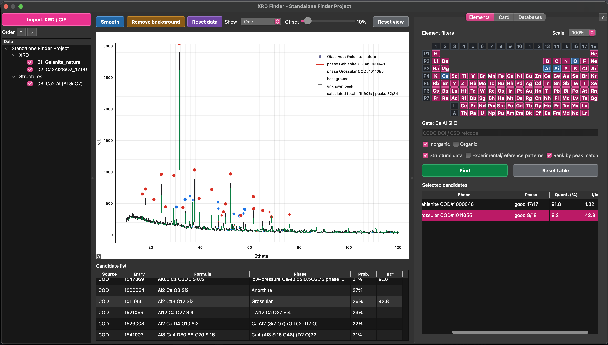
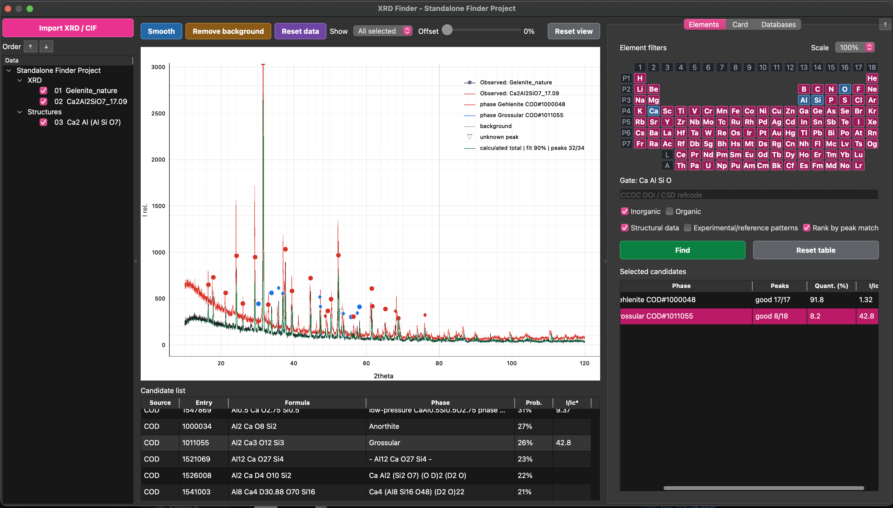
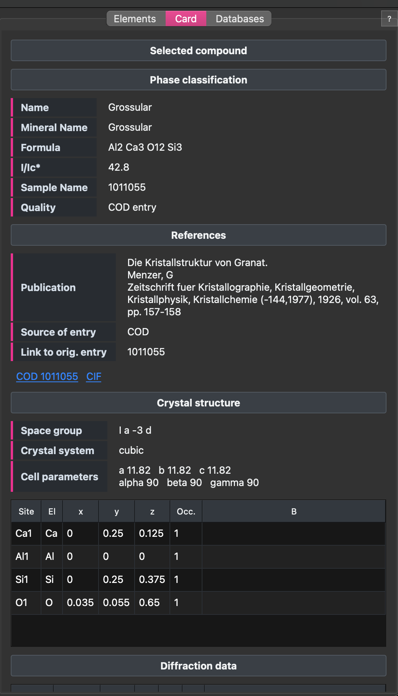

# XRD Analysis Toolkit


# Introduction

Welcome to the **XRD Analysis Toolkit** project. Its first application, **XRD Phase Finder**, is an open-source Python tool for phase identification from powder X-ray diffraction (XRD) data. It combines experimental pattern handling, element-constrained database search, reference-pattern preview, CIF-based diffraction simulation and practical candidate ranking in one desktop workflow.

XRD Phase Finder is designed for everyday search-match work: import one or many experimental XRD patterns, restrict the chemistry with required or optional elements, search local and online phase sources, compare candidates against the observed pattern, inspect compound cards and build an interpretable set of selected phases.

The project is possible because of the scientific software and crystallographic-data ecosystem around powder diffraction.

Open or publicly accessible data sources and services that XRD Phase Finder can work with include:

- COD (Crystallography Open Database)
- Materials Project (MP), when the user provides their own API key
- AFLOW Database
- OQMD (Open Quantum Materials Database)
- RRUFF Project measured powder patterns
- user-provided CIF folders and local phase libraries

Restricted, proprietary or license-controlled sources can also be used only when the user already has the legal right to access them:

- PDF-2 reference-card data from a user-provided local PDF-2 installation or folder
- CCDC/CSD data through the user's own CCDC Python API installation and valid license/access rights
- any other local commercial, institutional or private crystallographic database supplied by the user

The developers of XRD Phase Finder **do not distribute closed, proprietary or license-controlled databases**. The program only provides optional connectors, import/indexing tools and local search workflows. Users are responsible for ensuring that they have the right to access and process any restricted database, and for following the license terms, attribution rules and citation requirements of each data source.

XRD Phase Finder also builds on the open-source Python scientific stack, including:

- pymatgen
- NumPy, SciPy and pandas
- matplotlib
- PySide6 / Qt

Large third-party databases are **not bundled** with this repository or installer. XRD Phase Finder uses official online access, user-provided local folders, user API keys or optional local imports where available.

The main mechanism behind XRD Phase Finder is intentionally pragmatic: it first helps the user find chemically plausible candidates, then compares each candidate's own strongest calculated or measured peaks against the active experimental pattern. This is meant for phase identification and pre-refinement screening, not as a replacement for full Rietveld refinement.

---
# Screenshots

## Phase Search Overview



The main Phase Finder view combines an observed XRD pattern, selected candidate phases, calculated profiles, peak markers and element-based search controls.

## Candidate Preview


Single-clicking a candidate previews its strongest reference or calculated peaks directly in the experimental pattern area. Double-clicking a structural candidate adds it to the selected phase set.

## Multi-pattern Comparison



Several checked XRD patterns can be displayed together with a controlled vertical offset. The highlighted row in the project tree remains the active pattern for search and candidate preview.

## Compound Card



The compound card shows phase metadata, formula, I/Ic estimate, publication/source links, space group, cell parameters, atom positions and diffraction lines when available.

## Database Management


The Databases tab controls which sources participate in search and provides explicit update/clear actions for local caches.

# Features

## Search and Identification

- Powder XRD pattern viewer
- Automatic peak detection
- Element filters with required and optional elements
- COD online search and local COD/CIF indexing
- User CIF library indexing
- Optional CCDC/CSD DOI/refcode lookup when the CCDC Python API is available
- Optional Materials Project search with API key
- Optional RRUFF measured powder-pattern overlays
- Optional PDF-2 reference-card support 
- Candidate ranking by estimated peak-match probability for locally available structures

## Visualization

- Single-pattern and multi-pattern XRD display
- Vertical offset control for stacked XRD patterns
- Stable zoom while browsing candidates
- Candidate preview peaks shown directly over the active XRD pattern
- Persistent selected-phase overlays with editable colors
- Optional HKL labels
- High-resolution plot export

## Structure and Phase Data

- Drag-and-drop import for XRD and CIF files
- CIF-based diffraction pattern simulation
- Multi-phase profile calculation
- Automatic profile scaling
- Peak assignment framework
- Identification of unexplained diffraction peaks
- Compound cards with cell parameters, atom positions and publication links
- Diffraction-line tables in compound cards
- Cross-platform support (Windows, macOS and Linux)

---

# Typical Workflow

```text
Load experimental XRD
        |
        |
Peak detection
        |
        |
Search candidate phases
(COD / local CIF / RRUFF / PDF-2 / CCDC / Materials Project)
        |
        |
Load crystal structures (CIF)
        |
        |
Calculate theoretical diffraction patterns
        |
        |
Compare experimental and calculated profiles
        |
        |
Assign diffraction peaks
        |
        |
Identify unexplained peaks
```

---

# Interaction Guide

- **Element table**
  - Left click marks an element as required.
  - Right click marks an element as optional.
  - Clicking again removes that element from the gate.
- **Candidate list**
  - Single click previews the candidate and opens its card.
  - Double click adds a structural candidate to the selected phase set.
  - Right click opens actions such as add, calculate overlay and export CIF.
- **Selected candidates**
  - Single click shows that phase in the plot and card.
  - Right click changes color, exports CIF, removes the phase or clears the list.
- **Project tree**
  - The highlighted XRD row is the active pattern for search and preview.
  - Checkboxes control what is visible in the plot.
  - Order arrows change plot and legend order.
- **Plot**
  - Use mouse zoom/pan normally.
  - `Reset view` or right click -> `Show full pattern` returns to the full range.

The `?` button in the application opens a compact in-app helper with the same core controls.

---

# Installation

## Minimum Requirements

### Windows installer

- Windows 10 or Windows 11, 64-bit recommended.
- Internet access for first-time setup, because the installer may need to download Python and Python packages.
- Permission to install the application. The installer requests administrator rights for installation into `Program Files`.
- Approximately 1 GB of free disk space is recommended for the shared Python environment and scientific packages.

### Manual setup from source

- Python **3.11** or newer.
- `pip` and Python virtual environment support.
- Internet access for installing Python packages.
- macOS or Linux users should install from source using the setup scripts in the repository root.

XRD Phase Finder creates a shared per-user environment named `XRD_Toolkit` under the user's application-data folder on Windows. Future XRD applications from the same toolkit can reuse this environment.

Large external crystallographic databases are optional and user-managed. COD, RRUFF, PDF-2, Materials Project and CCDC/CSD data are not redistributed with the installer.

---

## Windows

The recommended Windows installation method is the release installer:

```text
XRD_Phase_Finder_Setup_1.0.2.exe
```

Download it from the GitHub Releases page and run it. The installer:

- installs XRD Phase Finder into the selected application folder
- creates Start Menu and optional Desktop shortcuts
- creates or reuses the shared `XRD_Toolkit` Python environment in user AppData
- installs the required Python packages
- adds an uninstall entry to Windows
- checks for updates when XRD Phase Finder starts

If Python 3.11 is not already available, the setup script first tries `winget` and then falls back to the official Python 3.11.9 installer from python.org.

### Windows manual setup

Developers or users running directly from a source checkout can still use:

```text
setup_env.bat
```

Launch the graphical interface:

```text
XRD_Finder\run_finder.bat
```

Command line interface:

```text
XRD_Finder\run_finder_cli.bat
```

---
## macOS

Run

```text
setup_env.command
```

Launch the application

```text
XRD_Finder/run_finder.command
```

Command line interface

```text
XRD_Finder/run_finder_cli.command
```

If macOS blocks the scripts after copying or syncing the folder, run this once
from Terminal inside the project directory:

```bash
chmod +x setup_env.command XRD_Finder/*.command
xattr -dr com.apple.quarantine .
```

---

## Linux

Run

```bash
chmod +x setup_env.sh XRD_Finder/*.sh
./setup_env.sh
```

Launch the application

```bash
./XRD_Finder/run_finder.sh
```

Command line interface

```bash
./XRD_Finder/run_finder_cli.sh
```

On a minimal Linux installation you may also need Python venv/pip and Qt desktop
libraries:

```bash
sudo apt install python3 python3-venv python3-pip libxcb-cursor0 libegl1
```

For Fedora:

```bash
sudo dnf install python3 python3-pip xcb-util-cursor mesa-libEGL
```

---

# Opening Files from the Command Line

GUI

```text
XRD_Finder\run_finder.bat --pattern "path\to\pattern.xy" --cif "path\to\phase.cif"
./XRD_Finder/run_finder.command --pattern "path/to/pattern.xy" --cif "path/to/phase.cif"
./XRD_Finder/run_finder.sh --pattern "path/to/pattern.xy" --cif "path/to/phase.cif"
```

CLI

```text
XRD_Finder\run_finder_cli.bat "path\to\pattern.xy" --cif "path\to\phase.cif"
./XRD_Finder/run_finder_cli.command "path/to/pattern.xy" --cif "path/to/phase.cif"
./XRD_Finder/run_finder_cli.sh "path/to/pattern.xy" --cif "path/to/phase.cif"
```

---

# Optional Materials Project Support

Materials Project support is optional and is **not installed by default**.

Install the optional dependencies

```bash
pip install -r XRD_Finder/requirements-optional.txt
```

or

```bash
.venv\Scripts\python.exe -m pip install -r XRD_Finder/requirements-optional.txt
```

Then enter your Materials Project API key in the application settings.

---

# Optional Reference Databases

The **Databases** tab controls which sources participate in phase search.
Use the checkboxes to enable only the databases you want:

- User library
- COD local
- COD online
- RRUFF
- PDF-2
- Materials Project

Large databases are never downloaded automatically. Use the buttons in
**Databases** to download or index them explicitly:

- `Index COD CIF folder` for an unpacked local COD CIF collection
- `Index COD ZIP archive` for a downloaded COD archive
- `Download COD archive URL` when you have a direct COD ZIP URL
- `Download RRUFF` and `Index RRUFF` for RRUFF measured powder patterns

RRUFF entries are measured reference patterns. They can be overlaid on the
experimental pattern, but they are not calculated CIF phase profiles.

PDF-2 entries are local reference cards. The software can read a local
PDF-2 folder when available, but the PDF-2 database itself is not bundled
or redistributed.

See [Third-party Data Sources](THIRD_PARTY_DATA_SOURCES.md) for notes on COD,
Materials Project, RRUFF and optional CCDC/CSD data usage and attribution.

---

# Multi-pattern Figures

Use `Show -> All selected` to display all checked XRD patterns from the project
tree. The `Offset` slider controls vertical separation between patterns as a
percentage of the previous pattern height.

The active XRD pattern is the row highlighted in the project tree. Search,
candidate preview and phase calculations always use the active pattern only.
Use the `Order` arrow buttons above the project tree to change the display order
of XRD patterns and CIF phases.

Zoom is intentionally stable while browsing candidates or changing the active
pattern. Use `Reset view` or right-click the plot and choose `Show full pattern`
to return to the full view.

---

# Repository Structure

```text
XRD_Analysis_Toolkit/
    README.md
    CHANGELOG.md
    PROJECT_HEALTH.md
    pyproject.toml
    setup_env.bat
    setup_env.command
    setup_env.sh
        Create the shared Toolkit virtual environment (.venv)

    XRD_Finder/
        xrd_finder/
            XRD Phase Finder application source code
        docs/screenshots/
            Screenshots used by the README
        requirements.txt
            Required Python packages for XRD Phase Finder
        requirements-optional.txt
            Optional online database support
        run_finder.bat
        run_finder.command
        run_finder.sh
            Launch graphical interface
        run_finder_cli.bat
        run_finder_cli.command
        run_finder_cli.sh
            Command line interface
```

The root `XRD_Analysis_Toolkit` layout keeps the shared environment and project documentation separate from the `XRD_Finder` application folder. This is intentional: it keeps the repository ready for additional XRD-related modules later without changing the Finder app structure.

Downloaded databases, user libraries, temporary files and local caches for XRD Phase Finder are stored under `XRD_Finder/data/` by default. This folder is intentionally excluded from Git, so large database files and local working data stay with the Finder app without being committed. Set `XRD_FINDER_DATA_DIR` to use a custom location.

---

# Scientific Background

The software combines several standard crystallographic approaches:

- Bragg diffraction
- Structure-factor based diffraction simulation
- CIF crystallographic models
- Multi-phase profile fitting
- Peak assignment
- Open crystallographic databases

The current implementation is intended for **initial phase identification** and **visual interpretation** of powder diffraction patterns. It is **not** intended to replace full-profile refinement packages such as GSAS-II, FullProf or TOPAS.

---

# Current Status

Current development stage: **1.0 stable release**.

The application is ready for practical search-match and visual phase-identification workflows. Quantification, I/Ic and probability values should be treated as interpretive aids rather than a substitute for full-profile refinement.

Planned next steps include batch processing, stronger separation of fitting services from the UI layer and expanded automated tests.

---

# License

MIT License

---

# Citation

If you use this software in scientific research, please cite this GitHub repository.

A dedicated software publication describing the Phase Finder algorithm is currently in preparation.

---

# Author

**Artem B. Kuznetsov**

Institute geology and mineralogy SB RAS

GitHub:
https://github.com/ABKuznetsov

