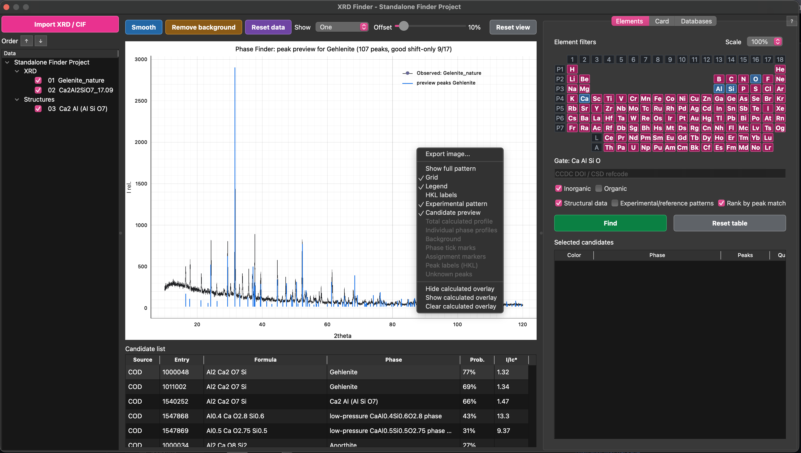
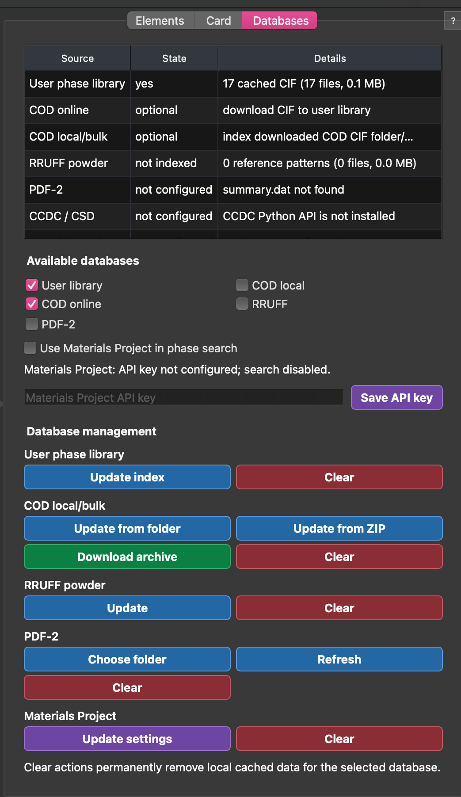

# XRD Analysis Toolkit


**XRD Analysis Toolkit** is an open-source, cross-platform application for **phase identification from powder X-ray diffraction (XRD) patterns** using open crystallographic databases, local reference libraries and CIF-based diffraction simulation.

The project is designed as a lightweight research tool for search-match work: import one or many experimental diffraction patterns, select elemental constraints, search candidate phases, preview reference peaks, calculate CIF-based profiles and build an interpretable set of selected phases.

It is especially focused on practical laboratory workflows where the user needs to compare experimental XRD data with COD/CIF structures, local phase libraries, RRUFF measured patterns, Materials Project structures, CCDC/CSD entries and optional PDF-2 cards.

---

# Screenshots

## Phase Search Overview


The main Phase Finder view combines an observed XRD pattern, selected candidate phases, calculated profiles, peak markers and element-based search controls.

## Candidate Preview



Single-clicking a candidate previews its strongest reference or calculated peaks directly in the experimental pattern area. Double-clicking a structural candidate adds it to the selected phase set.

## Multi-pattern Comparison


Several checked XRD patterns can be displayed together with a controlled vertical offset. The highlighted row in the project tree remains the active pattern for search and candidate preview.

## Compound Card


The compound card shows phase metadata, formula, I/Ic estimate, publication/source links, space group, cell parameters, atom positions and diffraction lines when available.

## Database Management



The Databases tab controls which sources participate in search and provides explicit update/clear actions for local caches.

# Features

## Search and Identification

- Powder XRD pattern viewer
- Automatic peak detection
- Element filters with required and optional elements
- COD online search and local COD/CIF indexing
- User CIF library indexing
- Optional CCDC/CSD DOI/refcode lookup when the CCDC Python API is available
- Optional Materials Project search with API key
- Optional RRUFF measured powder-pattern overlays
- Optional PDF-2 reference-card support 
- Candidate ranking by estimated peak-match probability for locally available structures

## Visualization

- Single-pattern and multi-pattern XRD display
- Vertical offset control for stacked XRD patterns
- Stable zoom while browsing candidates
- Candidate preview peaks shown directly over the active XRD pattern
- Persistent selected-phase overlays with editable colors
- Optional HKL labels
- High-resolution plot export

## Structure and Phase Data

- Drag-and-drop import for XRD and CIF files
- CIF-based diffraction pattern simulation
- Multi-phase profile calculation
- Automatic profile scaling
- Peak assignment framework
- Identification of unexplained diffraction peaks
- Compound cards with cell parameters, atom positions and publication links
- Diffraction-line tables in compound cards
- Cross-platform support (Windows, macOS and Linux)

---

# Typical Workflow

```text
Load experimental XRD
        │
        ▼
Peak detection
        │
        ▼
Search candidate phases
(COD / local CIF / RRUFF / PDF-2 / CCDC / Materials Project)
        │
        ▼
Load crystal structures (CIF)
        │
        ▼
Calculate theoretical diffraction patterns
        │
        ▼
Compare experimental and calculated profiles
        │
        ▼
Assign diffraction peaks
        │
        ▼
Identify unexplained peaks
```

---

# Interaction Guide

- **Element table**
  - Left click marks an element as required.
  - Right click marks an element as optional.
  - Clicking again removes that element from the gate.
- **Candidate list**
  - Single click previews the candidate and opens its card.
  - Double click adds a structural candidate to the selected phase set.
  - Right click opens actions such as add, calculate overlay and export CIF.
- **Selected candidates**
  - Single click shows that phase in the plot and card.
  - Right click changes color, exports CIF, removes the phase or clears the list.
- **Project tree**
  - The highlighted XRD row is the active pattern for search and preview.
  - Checkboxes control what is visible in the plot.
  - Order arrows change plot and legend order.
- **Plot**
  - Use mouse zoom/pan normally.
  - `Reset view` or right click -> `Show full pattern` returns to the full range.

The `?` button in the application opens a compact in-app helper with the same core controls.

---

# Installation

## Requirements

Python **3.11** or newer.

Download Python from the official website:

https://www.python.org/downloads/

Direct Python 3.11.9 installers:

- Windows 64-bit: https://www.python.org/ftp/python/3.11.9/python-3.11.9-amd64.exe
- Windows 32-bit: https://www.python.org/ftp/python/3.11.9/python-3.11.9.exe
- macOS: https://www.python.org/ftp/python/3.11.9/python-3.11.9-macos11.pkg

---

## Windows

Run

```text
setup_env.bat
```

The script automatically

- creates a virtual environment (`.venv`)
- installs all required Python packages

Launch the graphical interface

```text
run_finder.bat
```

Command line interface

```text
run_finder_cli.bat
```

---

## macOS

Run

```text
setup_env.command
```

Launch the application

```text
run_finder.command
```

Command line interface

```text
run_finder_cli.command
```

If macOS blocks the scripts after copying or syncing the folder, run this once
from Terminal inside the project directory:

```bash
chmod +x *.command
xattr -dr com.apple.quarantine .
```

---

## Linux

Run

```bash
chmod +x *.sh
./setup_env.sh
```

Launch the application

```bash
./run_finder.sh
```

Command line interface

```bash
./run_finder_cli.sh
```

On a minimal Linux installation you may also need Python venv/pip and Qt desktop
libraries:

```bash
sudo apt install python3 python3-venv python3-pip libxcb-cursor0 libegl1
```

For Fedora:

```bash
sudo dnf install python3 python3-pip xcb-util-cursor mesa-libEGL
```

---

# Opening Files from the Command Line

GUI

```text
run_finder.bat --pattern "path\to\pattern.xy" --cif "path\to\phase.cif"
./run_finder.command --pattern "path/to/pattern.xy" --cif "path/to/phase.cif"
./run_finder.sh --pattern "path/to/pattern.xy" --cif "path/to/phase.cif"
```

CLI

```text
run_finder_cli.bat "path\to\pattern.xy" --cif "path\to\phase.cif"
./run_finder_cli.command "path/to/pattern.xy" --cif "path/to/phase.cif"
./run_finder_cli.sh "path/to/pattern.xy" --cif "path/to/phase.cif"
```

---

# Optional Materials Project Support

Materials Project support is optional and is **not installed by default**.

Install the optional dependencies

```bash
pip install -r requirements-optional.txt
```

or

```bash
.venv\Scripts\python.exe -m pip install -r requirements-optional.txt
```

Then enter your Materials Project API key in the application settings.

---

# Optional Reference Databases

The **Databases** tab controls which sources participate in phase search.
Use the checkboxes to enable only the databases you want:

- User library
- COD local
- COD online
- RRUFF
- PDF-2
- Materials Project

Large databases are never downloaded automatically. Use the buttons in
**Databases** to download or index them explicitly:

- `Index COD CIF folder` for an unpacked local COD CIF collection
- `Index COD ZIP archive` for a downloaded COD archive
- `Download COD archive URL` when you have a direct COD ZIP URL
- `Download RRUFF` and `Index RRUFF` for RRUFF measured powder patterns

RRUFF entries are measured reference patterns. They can be overlaid on the
experimental pattern, but they are not calculated CIF phase profiles.

PDF-2 entries are local reference cards. The software can read a local Match
`PDF2-2004` folder when available, but the PDF-2 database itself is not bundled
or redistributed.

---

# Multi-pattern Figures

Use `Show -> All selected` to display all checked XRD patterns from the project
tree. The `Offset` slider controls vertical separation between patterns as a
percentage of the previous pattern height.

The active XRD pattern is the row highlighted in the project tree. Search,
candidate preview and phase calculations always use the active pattern only.
Use the `Order` arrow buttons above the project tree to change the display order
of XRD patterns and CIF phases.

Zoom is intentionally stable while browsing candidates or changing the active
pattern. Use `Reset view` or right-click the plot and choose `Show full pattern`
to return to the full view.

---

# Repository Structure

```text
xrd_manager/
    Main application source code

requirements.txt
    Required Python packages

requirements-optional.txt
    Optional online database support

CHANGELOG.md
    Release notes

setup_env.bat
setup_env.command
setup_env.sh
    Create Python virtual environment

run_finder.bat
run_finder.command
run_finder.sh
    Launch graphical interface

run_finder_cli.bat
run_finder_cli.command
run_finder_cli.sh
    Command line interface

pyproject.toml
    Package metadata
```

Downloaded databases, user libraries and local caches are intentionally excluded from the repository.
By default, new local cache data is stored outside the source tree in the user data directory
(`%LOCALAPPDATA%\XRD Finder` on Windows, `~/Library/Application Support/XRD Finder` on macOS,
and the XDG data directory on Linux). Set `XRD_MANAGER_DATA_DIR` to use a custom location.

---

# Scientific Background

The software combines several standard crystallographic approaches:

- Bragg diffraction
- Structure-factor based diffraction simulation
- CIF crystallographic models
- Multi-phase profile fitting
- Peak assignment
- Open crystallographic databases

The current implementation is intended for **initial phase identification** and **visual interpretation** of powder diffraction patterns. It is **not** intended to replace full-profile refinement packages such as GSAS-II, FullProf or TOPAS.

---

# Current Status

Current development stage: **1.0 stable release**.

The application is ready for practical search-match and visual phase-identification workflows. Quantification, I/Ic and probability values should be treated as interpretive aids rather than a substitute for full-profile refinement.

Planned next steps include batch processing, stronger separation of fitting services from the UI layer and expanded automated tests.

---

# License

MIT License

---

# Citation

If you use this software in scientific research, please cite this GitHub repository.

A dedicated software publication describing the Phase Finder algorithm is currently in preparation.

---

# Author

**Artem B. Kuznetsov**

Institute geology and mineralogy SB RAS

GitHub:
https://github.com/ABKuznetsov
