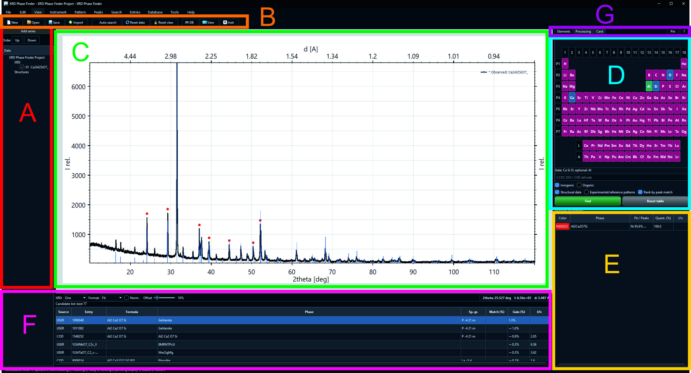

# XRD Phase Finder


**XRD Phase Finder** is a desktop program for interpreting powder X-ray diffraction patterns. It combines the experimental pattern, phase candidates, calculated profiles, selected phases and residual signal in one interface.

## Download

- [Windows installer: XRD_Phase_Finder_Setup_v1_6_4.exe](https://github.com/ABKuznetsov/XRD_Analysis_Toolkit/releases/download/v1.6.4/XRD_Phase_Finder_Setup_v1_6_4.exe)
- [macOS package: XRD_Phase_Finder_macOS_1.6.4.pkg](https://github.com/ABKuznetsov/XRD_Analysis_Toolkit/releases/download/v1.6.4/XRD_Phase_Finder_macOS_1.6.4.pkg)
- [Ubuntu / Debian package: XRD_Phase_Finder_1.6.4_amd64.deb](https://github.com/ABKuznetsov/XRD_Analysis_Toolkit/releases/download/v1.6.4/XRD_Phase_Finder_1.6.4_amd64.deb)

All available files are listed on the [XRD Phase Finder 1.6.4 release page](https://github.com/ABKuznetsov/XRD_Analysis_Toolkit/releases/tag/v1.6.4).

## Main window



The project tree (A) contains imported patterns and structures. The toolbar (B) provides the main file and analysis actions. The plot (C) shows experimental and calculated patterns. The element panel (D) controls the search composition. Selected phases appear in table (E), candidates in table (F), and the active card details in panel (G).

## Main features

- import XRD patterns and CIF files;
- search user libraries and configured crystallographic databases;
- filter candidates with the periodic table;
- compare experimental and calculated diffraction patterns;
- inspect Match, Gain, residual signal and unexplained peaks;
- adjust smoothing, background and amorphous contribution;
- select phases and compare their combined calculated profile;
- copy diffraction-table cells, columns or the complete table;
- save and reopen `.xpff` projects;
- export and import settings, instrument profiles and local caches.

## Install and run

### Windows

Download and run `XRD_Phase_Finder_Setup_v1_6_4.exe`. The installer creates Start Menu and Desktop shortcuts and registers `.xpff` project files.

On first launch, the launcher checks the per-user scientific Python runtime and offers to install or repair missing packages. User projects, settings and database caches are stored in the user profile.

### Ubuntu / Debian Linux

Download `XRD_Phase_Finder_1.6.4_amd64.deb` from the [1.6.4 release](https://github.com/ABKuznetsov/XRD_Analysis_Toolkit/releases/tag/v1.6.4) and install it with your package manager. The application can also be started from source:

```bash
git clone https://github.com/ABKuznetsov/XRD_Analysis_Toolkit.git
cd XRD_Analysis_Toolkit
python3.12 -m venv .venv
. .venv/bin/activate
python -m pip install -U pip setuptools wheel
python -m pip install -r requirements.txt
python -m xrd_finder.apps.finder_gui
```

Python 3.11 can be used when Python 3.12 is unavailable. If Qt fails under Wayland, start an X11 session or run:

```bash
QT_QPA_PLATFORM=xcb python -m xrd_finder.apps.finder_gui
```

### macOS

Download and run the current `.pkg` from the release page. For a direct source run, install the dependencies and execute:

```bash
./run_finder.command
```

## Basic workflow

1. Open an experimental XRD pattern.
2. Set the radiation and instrument profile when needed.
3. Use the Processing tab to adjust smoothing, background, crop and amorphous contribution.
4. Select required or possible elements in the periodic table.
5. Click **Find** and inspect the candidate patterns.
6. Accept confirmed phases and review the residual signal and Gain suggestions.
7. Save the interpretation as an `.xpff` project.

Use **Help -> Open example project** to open the bundled demonstration project without changing personal data.

## Offline use

The application has no telemetry. Prepared user CIF libraries, local indexes and cached database records remain available without a network connection. Select **Tools -> Network mode -> Offline / secure** to disable online searches and update checks.

See [SECURITY.md](SECURITY.md) for controlled-network deployment notes.

## Run from source on Windows

Install Python 3.11 or 3.12 and the dependencies from `requirements.txt`, then run:

```bat
run_finder.bat
```

Command-line entry points are also provided as `run_finder_cli.bat`, `run_finder_cli.sh` and `run_finder_cli.command`.

## License

MIT. See [LICENSE](LICENSE).
