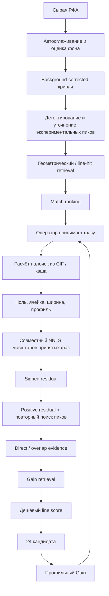

# Аудит конвейера интерпретации РФА в XRD Phase Finder

Дата аудита: 2026-10-02

Сравнение с Match!, HighScore, SNAP-1D и GSAS-II: [XRD_OTHER_SOFTWARE_COMPARISON_RU.md](XRD_OTHER_SOFTWARE_COMPARISON_RU.md).

Поиск исследовательских алгоритмов через SciSpace и предлагаемая совместная модель фаз: [XRD_LITERATURE_ALGORITHMS_SCISPACE_RU.md](XRD_LITERATURE_ALGORITHMS_SCISPACE_RU.md).

## Главный вывод

Программа уже не является одним алгоритмом `search-match`. В ней работают три связанные, но не полностью одинаковые вычислительные модели:

1. **Match** превращает дифрактограмму в короткий список наблюдаемых линий и ранжирует карточки по совпадению палочек.
2. **Принятые фазы** пересчитываются в непрерывные профили, подстраиваются по нулю, параметрам ячейки, ширине и масштабу и совместно аппроксимируют эксперимент.
3. **Gain** строит положительный остаток после принятых фаз, снова выделяет линии и ищет карточки, способные объяснить этот остаток.

Главный текущий провал находится на границе пунктов 2 и 3. Принятая карточка может подстроиться не только под свою фазу, но и под перекрывающиеся линии ещё не принятой фазы. После этого Gain заранее считает часть этих областей объяснёнными и не передаёт их в retrieval. Правильная фаза исчезает до дорогого профильного ранжирования.

Именно этим объясняется наблюдение: с клиноптилолитом-Na кварц появляется, а с близкой карточкой клиноптилолита-Ca исчезает. Меняется профиль принятой карточки, меняется присвоенная ей интенсивность, меняется residual и набор поисковых якорей Gain. Исходная РФА при этом не меняется.

Это системная зависимость от выбранной карточки и порядка принятия фаз. Исправлять её дополнительной подгонкой одного порога нельзя.

## Какую задачу фактически решает программа

Корректная продуктовая формулировка:

- **Match:** какие фазы оператору разумно проверить по исходной РФА?
- **Gain:** какие фазы оператору разумно проверить после того, как уже принятые фазы совместно объяснили часть РФА?

Обе величины являются **ranking score**, а не вероятностью присутствия фазы. Программа помогает оператору строить и проверять модель смеси. Она пока не выполняет полноценный глобальный фазовый анализ, в котором все возможные фазы одновременно конкурируют за интенсивность.



## Три представления одних данных

Внутри программы одна РФА последовательно представлена в трёх формах.

| Представление | Что содержит | Для чего используется | Что теряется |
|---|---|---|---|
| Непрерывная кривая | `2θ`, интенсивность, фон, форма пиков | Отрисовка, profile fit, residual | Ничего до preprocessing |
| Экспериментальные линии | центр, height, area, FWHM, prominence | Retrieval, Match, direct/overlap Gain | Асимметрия, плечи, полный профиль, неоднозначность перекрытия |
| Карточка / рассчитанный профиль | палочки, hkl, интенсивности, CIF, приборная функция | Match и моделирование принятой фазы | Зависит от полноты кэша и пути расчёта |

Переход от кривой к линиям является первой необратимой операцией. Если слабая или перекрытая линия не попала в список, последующий line retrieval её не восстановит. Переход от signed residual к его положительной части является второй необратимой операцией: переописанная принятым профилем область становится отрицательной и перестаёт быть поисковым якорем.

## Фактический конвейер по этапам

### 1. Preprocessing исходной РФА

Автоматический путь находится в `xrd_finder/services/preprocessing_service.py` и вызывается из `xrd_finder/ui/observed_pattern_actions.py`.

Он:

- выбирает консервативное сглаживание;
- оценивает инструментальный фон;
- сохраняет широкое рассеяние, чтобы аморфная составляющая не была автоматически уничтожена;
- возвращает `corrected_y` для scoring.

Это разумная схема для интерфейса, но дальше в Finder и Gain фон, шумовой уровень и сглаживание частично вычисляются заново. Поэтому «кривая, по которой искал Match», «кривая, которую подгоняет выбранная фаза» и «кривая, из которой строится Gain» не обязаны быть численно одинаковыми.

### 2. Выделение наблюдаемых линий для Match

`xrd_finder/ui/peak_matching.py`:

- ищет максимумы по слегка сглаженному сигналу;
- уточняет центр по исходному background-corrected сигналу;
- измеряет height, area и FWHM;
- применяет локальный порог примерно `3σ`;
- ограничивает измеренную FWHM диапазоном `0.05–0.90°`;
- сортирует линии в основном по высоте.

Плюс: сглаживание используется только для обнаружения, а параметры уточняются по несглаженной кривой.

Риск: retrieval получает ограниченное число наиболее высоких линий, а не наиболее информативных линий. Сильный общий пик многих фаз может вытеснить более слабую диагностическую линию. Шумовой максимум также способен занять место в первых позициях.

### 3. Retrieval кандидатов Match

`xrd_finder/services/candidate_search_service.py` сначала вызывает геометрический fingerprint. Если тот вернул хоть какие-то карточки, line-hit retrieval уже не добавляется.

Следствия:

- fingerprint является заменой, а не дополнением обычного поиска;
- одна ошибочная или пропущенная линия способна исказить геометрические комбинации;
- даже неполный fingerprint-результат блокирует альтернативный путь, который мог вернуть правильную фазу.

`xrd_finder/services/local_phase_cache.py` использует до 10 первых пиков как геометрические якоря и до 80 позиций в line search. Позиции ранжированы по высоте, а не по редкости линии в базе.

### 4. Match score

`xrd_finder/finder/fingerprint_matching.py` использует веса:

```text
observed coverage     0.44
candidate coverage    0.43
number of matches     0.08
alignment quality     0.05
```

Смысл компонент:

- `observed coverage`: сколько сильных экспериментальных линий объясняет кандидат;
- `candidate coverage`: сколько сильных линий кандидата присутствует в эксперименте;
- `number of matches`: достаточно ли независимых совпадений;
- `alignment quality`: насколько согласовано небольшое систематическое преобразование положения линий.

Для быстрого Match используется приближённое affine-преобразование оси `2θ`: нулевой сдвиг плюс масштаб относительно 45°. Это полезно для retrieval/ranking, но не является физическим описанием анизотропного изменения параметров ячейки.

Есть жёсткие ограничения score при малом числе совпадений и низкой доле сильных якорей. Они защищают от одно-линейных ложных совпадений, но делают Match зависимым от того, какие экспериментальные линии прошли детектор.

Все карточки сначала получают быстрый score. Полное уточнение alignment применяется только к объединению первых fingerprint-кандидатов и верхней части быстрого Match. Если правильная фаза не дошла до этой группы, подробный score её не спасёт.

### 5. Источник линий карточки

Для массового ranking обычно используются рассчитанные палочки из локального SQL-кэша (`derived_version == 9`). Для выбранной карточки Finder может пересчитать линии из CIF через CrIStMa и приборную модель.

Это создаёт возможное расхождение:

- в Match карточка ранжировалась по кэшированным палочкам;
- после выбора профиль строится по полному CIF и другому расчётному пути;
- количество, интенсивности и положение слабых линий могут различаться.

Ранее обнаруженная проблема с отсутствующим пиком LBO показывает, что полнота и версия рассчитанных линий являются не теоретическим, а реальным источником ошибок.

### 6. Что происходит после принятия фазы

`xrd_finder/finder/service.py` выполняет значительно более сложную модель:

1. получает линии из reference data или CIF;
2. определяет единый нулевой сдвиг по основной принятой фазе;
3. для индексированного CIF уточняет параметры ячейки;
4. оценивает общую форму пика;
5. оценивает FWHM каждой фазы;
6. строит непрерывные профили с приборной функцией и компонентами излучения;
7. совместно определяет неотрицательные масштабы принятых фаз методом NNLS.

Сильная сторона: единый нулевой сдвиг не позволяет каждой фазе независимо ездить по `2θ`. Для индексированных структур положение линий меняется через параметры ячейки.

Основной риск: ячейка и ширина принятой фазы оцениваются по **полной смеси**, где ещё присутствуют непринятые фазы.

`xrd_finder/finder/cell_parameter_estimator.py` сопоставляет сильные рассчитанные hkl ближайшим наблюдаемым максимумам в пределах допуска. Эти наблюдаемые максимумы ещё не имеют фазовой принадлежности. Перекрытый или чужой пик может участвовать в уточнении ячейки принятой фазы.

`xrd_finder/finder/profile_width_estimator.py` ищет локальные максимумы около изолированных палочек карточки. «Изолированная» означает изолированную среди линий этой карточки, но не обязательно свободную от линий другой фазы. Поэтому чужое перекрытие может увеличить оценённую ширину принятой фазы.

Для неиндексированных случаев также существует snapping рассчитанных линий к наблюдаемым максимумам. На смеси это особенно опасно: неправильная карточка получает возможность следовать за чужими линиями.

### 7. Масштабы и условная количественная оценка

Принятые фазовые профили совместно подгоняются NNLS. Это полезнее последовательного вычитания фиксированных профилей: масштабы всех фаз могут перераспределиться после добавления новой.

Но NNLS отвечает только на вопрос, какая неотрицательная линейная комбинация **данных профилей** лучше описывает сигнал. Если профиль принятой карточки слишком широкий, имеет лишние линии или подстроенную ячейку, NNLS имеет право отдать ему интенсивность другой фазы.

Отображаемая доля рассчитывается из scale и массы элементарной ячейки. Это приближённая оценка, а не полноценная количественная ритвельдовская доля: она зависит от правильности структуры, интенсивностей, текстуры, поглощения и профильной модели.

### 8. Формирование residual для Gain

`xrd_finder/ui/analysis_windows.py` строит Gain-контекст отдельно от FinderService:

1. берёт обработанный observed/background;
2. обрезает отрицательные значения после вычитания фона;
3. вычитает ещё один глобальный noise floor;
4. повторно определяет пики target;
5. повторно оценивает FWHM принятых фаз;
6. повторно строит их профили;
7. повторно подгоняет их масштабы NNLS;
8. вычисляет `signed residual = target - selected_total`;
9. сглаживает residual, оставляет положительную часть и вычитает малый остаточный floor.

Это второй профильный тракт. Он использует часть параметров последнего Match/Finder fit, но не гарантирует тождественность отображённому профилю. Следовательно, оператор может видеть одну модель, а retrieval Gain фактически анализировать немного другую.

### 9. Direct и overlap evidence

Gain выделяет два основных источника свидетельства.

**Direct** — положительные residual-пики вдали от линий принятых фаз.

Перед передачей в retrieval direct-пик удаляется, если:

- он находится около палочки принятой фазы; или
- он находится около сильного максимума её рассчитанного профиля и residual недостаточно велик.

Текущие окна зависят от FWHM и доходят примерно до `0.7–1.0°`. Это не просто оценка score. Это раннее бинарное решение: линия либо остаётся поисковым якорем, либо полностью исчезает из direct retrieval.

**Overlap** — экспериментальный максимум около линии принятой фазы, в котором рассчитанный профиль заметно ниже наблюдаемого. После последнего исправления дефицит измеряется локально около конкретной линии, а не по независимым максимумам широкого окна. Это устранило один реальный дефект.

Но overlap всё равно проходит пороги:

- residual выше локального noise floor;
- дефицит составляет не менее 12% наблюдаемой высоты.

Если принятая карточка уже забрала достаточно интенсивности, overlap evidence не создаётся. Таким образом, ошибка модели принятой фазы предшествует и direct, и overlap.

### 10. Retrieval и ranking Gain

В отличие от Match, Gain объединяет два retrieval-канала:

- геометрический fingerprint по residual-пикам;
- независимый line-hit поиск по первым residual-позициям.

Это правильнее и устойчивее к одной ошибочной линии.

Затем дешёвый Gain учитывает:

- direct evidence;
- overlap evidence;
- слабое hidden evidence;
- пропущенные сильные линии кандидата;
- линии, уже относимые к принятым фазам;
- покрытие residual и число независимых совпадений.

Комбинация direct и overlap использует схему `winner + corroboration`: главный канал определяет score, второй даёт небольшой бонус. Direct дополнительно умножается на надёжность.

Только 24 кандидата проходят в дорогой профильный Gain (`xrd_finder/services/gain_shortlist.py`). Профильный этап проверяет, насколько добавление одного профиля уменьшает residual, и учитывает SNR.

Критическое ограничение: профильный этап не может восстановить кандидата, который не попал в эти 24 карточки. Более того, profile support в текущей политике в основном подтверждает или уменьшает line evidence; он не создаёт высокий Gain из нулевого line evidence.

### 11. Подавление дублей

Дубли выбранных фаз сравниваются по fingerprint палочек, а не по названию, формуле или номеру карточки. Это правильное решение, поскольку одинаковая фаза может называться по-разному.

Сравнение требует взаимного покрытия сильных линий и допускает геометрическую fingerprint-эквивалентность. Возможны две крайности:

- близкая фаза с немного изменённой ячейкой не будет распознана как дубль;
- близкие полиморфы или структурные варианты могут быть ошибочно объединены.

Это отдельная проблема, но она не является главным объяснением исчезновения кварца. Кварц, вероятнее всего, теряется ещё при построении residual и retrieval.

## Почему порядок принятия фаз меняет ответ

Пусть реальный сигнал содержит две фазы:

\[
y(2\theta)=A_{true}(2\theta)+B_{true}(2\theta)+\varepsilon.
\]

Оператор первым принимает карточку `A'`, которая только приближённо соответствует `A_true`. Программа разрешает `A'` уточнить ячейку, ширину и масштаб на всей смеси:

\[
\hat A'=s\,P(2\theta; cell, width, instrument).
\]

Если часть линий `B_true` перекрывается с `A'`, оптимизация уменьшает общую ошибку, присваивая часть этой интенсивности `A'`. Затем retrieval Gain получает:

\[
r_+(2\theta)=\max(y(2\theta)-\hat A'(2\theta)-floor,0).
\]

Информация из отрицательной части и из «достаточно закрытых» overlap-областей больше не участвует как поисковый якорь. Поэтому замена `A'` на близкую карточку `A''` изменяет `r_+`, хотя реальный образец один и тот же.

Это и есть эффект Na/Ca-клиноптилолита:

1. карточки имеют близкие, но разные положения и относительные интенсивности линий;
2. по-разному уточняются ячейка и ширина;
3. NNLS отдаёт им разную часть интенсивности в областях кварца;
4. direct-фильтр удаляет разные residual-пики;
5. overlap-порог пропускает разные дефициты;
6. кварц либо попадает, либо не попадает в Gain shortlist.

## Что уже доказывает синтетический benchmark

Результаты `build/detection-limits-adaptive/detection_limits.md`:

| Сценарий | Retrieval@24 | Gain Top-10 | Top-10 при условии, что фаза retrieved |
|---|---:|---:|---:|
| 2 фазы, первый Gain | 47.9% | 39.6% | 82.6% |
| 3 фазы, первый Gain | 58.6% | 44.8% | 74.3% |
| 4 фазы, первый Gain | 52.5% | 32.8% | 62.5% |
| 3 фазы, второй Gain | 40.4% | 32.7% | 81.0% |
| 4 фазы, третий Gain | 30.2% | 24.5% | 81.2% |

Вывод: когда правильная фаза дошла до дорогого этапа, полный Gain обычно ранжирует её значительно лучше. Основная потеря происходит **до profile ranking**: при формировании residual evidence, retrieval и отсечении shortlist.

Однако benchmark использует oracle-порядок: перед каждым шагом принимаются правильные предыдущие фазы. Он почти не проверяет главный реальный риск — выбор другой близкой карточки той же минеральной группы. Поэтому хорошие условные результаты не опровергают наблюдение с клиноптилолитом.

## Карта провалов

| Класс отказа | Как проявляется | Где искать причину | Приоритет |
|---|---|---|---:|
| Разные вычислительные тракты | Match, отображённый fit и Gain видят разные пики/target/profile | preprocessing, FinderService, `_candidate_gain_context` | P0 |
| Загрязнение параметров принятой фазы | другая карточка или порядок резко меняет residual | cell matching, width estimation, snapping | P0 |
| Жёсткое «пик закрыт» | видимый недоописанный пик не попадает в retrieval | direct/overlap classification | P0 |
| Потеря до shortlist | условный Gain хороший, общий recall плохой | residual peaks, SQL retrieval, top-24 | P0 |
| Fingerprint-only Match retrieval | правильная фаза отсутствует даже при line hits | `candidate_search_service.py` | P1 |
| Приближённый affine alignment | близкая неверная карточка получает высокий Match | `fingerprint_matching.py` | P1 |
| Несогласованный кэш линий | палочки Match и профиль выбранной фазы отличаются | local cache / CIF / CrIStMa | P1 |
| Подавление структурных вариантов | нужная карточка скрывается как дубль | `phase_pattern_equivalence.py` | P2 |

## Какие измерения нужны до следующего изменения алгоритма

### 1. Сквозной audit одной известной фазы

Для каждой проверяемой фазы записывать:

```text
reference available
→ retrieval rank
→ quick Match rank
→ refined Match rank
→ direct/overlap residual anchors
→ Gain SQL rank
→ cheap Gain rank
→ profile-24 inclusion
→ final Gain rank / reason for dash
```

Это даст точный первый этап, на котором исчезла правильная фаза. Без такого trace мы видим только пустую итоговую ячейку и вынуждены гадать.

### 2. Журнал параметров принятой фазы

Для каждой принятой фазы сохранять:

- исходную и уточнённую ячейку;
- глобальный zero shift;
- использованные пары `hkl ↔ observed peak`;
- какие линии определили FWHM;
- scale NNLS;
- долю профиля в каждой overlap-области;
- число уникальных и неоднозначных опорных линий.

Это покажет, какая именно чужая линия сдвинула ячейку, расширила профиль или увеличила scale.

### 3. Benchmark порядка и вариантов карточек

Нужен отдельный stress-set:

- истинная смесь фиксирована;
- основная фаза принимается правильной карточкой;
- затем близкой карточкой того же минерала;
- затем карточкой с похожим fingerprint;
- проверяются все допустимые порядки принятия фаз.

Основная метрика:

```text
Gain retrieval recall@24 правильной следующей фазы
как функция принятой карточки и порядка
```

Дополнительная метрика — стабильность набора unexplained peaks. Если от близкой карточки исчезает большая часть независимых residual-линий, проблема находится в модели принятой фазы, а не в Gain score.

### 4. Разделение unique и ambiguous support

Для уточнения ячейки и ширины надо отдельно считать:

- **unique support** — линия карточки соответствует хорошо разрешённому экспериментальному максимуму и не находится в плотном перекрытии;
- **ambiguous support** — максимум широкий, асимметричный, имеет несколько близких палочек или может принадлежать другой фазе.

На первом эксперименте параметры ячейки и ширины следует оценивать только по unique support. Ambiguous support может влиять на scale, но не должен свободно изменять форму принятой фазы.

### 5. Signed-residual diagnostics

Для каждой области наблюдаемого пика хранить три значения:

- observed area/height;
- вклад уже принятых фаз;
- signed deficit/excess.

Нельзя оценивать наличие ещё одной фазы только по положительному максимуму после clipping. Отрицательный residual нужен как признак того, что принятая фаза переописала область.

## Последовательность следующих экспериментов

### Эксперимент A — единый AnalysisPattern

Создать одну внутреннюю структуру данных, которая хранит:

- исходную и background-corrected кривую;
- единый noise model;
- единый набор уточнённых experimental peaks;
- instrument model;
- версии preprocessing и reference lines.

Match, FinderService и Gain должны получать этот объект, а не независимо пересчитывать сходные данные. Это не требует немедленно менять score; сначала убирается скрытое расхождение входов.

### Эксперимент B — заморозить форму принятой фазы по unique peaks

Сравнить два режима:

1. текущий — ячейка и ширина оцениваются по всем доступным совпадениям;
2. экспериментальный — ячейка и ширина оцениваются только по unique high-confidence peaks, а в overlap меняются лишь масштабы.

Проверить Na/Ca-клиноптилолит и синтетический card/order stress-set. Если кварц становится устойчивым к выбору близкой карточки, корневая гипотеза подтверждена.

### Эксперимент C — мягкая объяснённость линии

Не удалять residual-пик только из-за близости к палочке принятой фазы. Хранить непрерывную величину:

```text
unexplained_fraction = positive local deficit / observed local signal
```

и доверие к ней по SNR, FWHM и асимметрии. Эта величина может ослабить retrieval-якорь, но не уничтожать его до конкурентного сравнения кандидатов.

### Эксперимент D — объединить retrieval Match

Как уже сделано для Gain, объединить fingerprint и line-hit кандидатов Match, затем дешёво переранжировать общий список. Измерить recall до и после при неизменном подробном Match.

### Эксперимент E — локальная конкуренция кандидата с принятыми фазами

После дешёвого retrieval для 24 кандидатов выполнять совместную подгонку scale кандидата и принятых фаз при зафиксированных/регуляризованных ячейках и ширинах принятых фаз. Проверять не только улучшение положительного residual, но и уменьшение signed error без нового переописания.

## Что сейчас не следует делать

- Не подбирать ещё один порог по одной смеси.
- Не увеличивать вслепую shortlist 24 → 100: правильная фаза часто теряется раньше, а профильный расчёт станет заметно медленнее.
- Не считать фазы дублями по названию, формуле или номеру карточки.
- Не называть Match/Gain вероятностью присутствия.
- Не разрешать каждой фазе независимый постоянный сдвиг `2θ`.
- Не использовать FWHM как жёсткий фильтр; это признак доверия и перекрытия.
- Не считать хороший displayed fit доказательством полноты фазовой модели: широкий или неверно подстроенный профиль тоже может уменьшить ошибку.

## Приоритет решения

1. Добавить сквозной trace и card/order benchmark.
2. Устранить независимые preprocessing/peak/profile пути или хотя бы явно синхронизировать их входы.
3. Защитить cell/width принятой фазы от неоднозначных overlap-пиков.
4. Заменить бинарное «закрыт/не закрыт» на мягкую unexplained intensity.
5. После этого повторно оценить retrieval и только затем менять формулу Gain.

До выполнения первых четырёх пунктов дальнейшая оптимизация весов Gain будет смешивать две разные задачи: качество ранжирования кандидата и качество residual, на котором этот кандидат вообще был найден.
